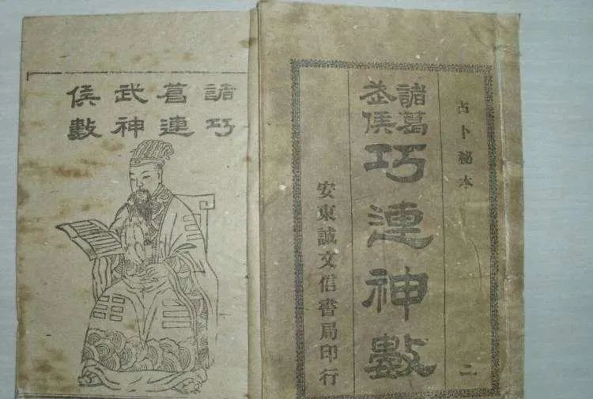

# 《诸葛神推》（诸葛神算）全本及详细解释

> 本文整理自明天机周易网公开文章，主要对原网页进行 Markdown 结构化排版。条文及解释属于传统民俗资料，不具有科学验证意义，请理性阅读。

- **原文标题**：全本《诸葛神推》（诸葛神算）及详细解释｜诸葛武侯巧连数全本在线
- **原文发布日期**：2022-11-14
- **网页标注更新时间**：2025-06-26
- **原文链接**：[https://mingtianji.com/2022/11/14/6756/](https://mingtianji.com/2022/11/14/6756/)

## 内容简介

这是北京一位易友提供的，他是在街上碰到一位算命先生，先生用其姓名来推，一句话就概括了他的一生，先生又推了一些名人，也很准确。朋友几经艰辛，借到先生的秘籍，复印整理出来，我看是一种民间方术，有点类似诸葛神数，用它来推名，应该可以参考的。

## 推算方法

古传诸葛神推共 215 个条文，只要得出一组数字即可对照条文来看，超过 215 的，则减去 215，直到条文数目在 215 以内。

### 三字姓名

如测姓名：总共三字时，姓作百位数，中间一字作十位数，最后一字作个位数，如某某某，分别是 12、7、9，则为 120+70+9=199，看第 199 条的条文。

### 二字姓名

总共二字时，姓作十位数，后一字作个位数，如某某，分别是21、12，则为 210+12=222，因为超过215，则为 222-215=7，看第 7 条则可！

> **注意**：以下凡是没说名字情况者，皆为一般情况，可以继续用此名之意，特此说明。

## 条文索引

- [第一至五十条](#第一至五十条)
- [第五十一至一百条](#第五十一至一百条)
- [第一百零一至一百五十条](#第一百零一至一百五十条)
- [第一百五十一至二百条](#第一百五十一至二百条)
- [第二百零一至二百一十五条](#第二百零一至二百一十五条)

## 第一至五十条

### 1. 【混沌初开，乾坤乃定，日月合璧，凤凰和鸣】

**总体判断**：特吉特利

开天辟地就定下了天地和东南西北，日月星天空，最大的照明物，过去讲的是太阳公公，月亮婆婆，意思是前途光明，古来讲朝廷为凤，娘娘为凰，他俩共同议论锦绣江山，国泰民安，安定治国，安家乐业，高级运气。

**姓名判断**：大有前途。

---

### 2. 【苍蝇之飞，不过数步，附於骥尾，则腾千里】

**总体判断**：一般运气

这是比方语，苍蝇飞不上几步，贴在好马的尾巴上，利用马的力量，跑的远，比喻自己的力量达不到目的和要求，需要别的努力。

**姓名判断**：一般。

---

### 3. 【莫言多，莫行过，虽是千伶百俐，不如一推二摩】

小心谨慎，老是怕烫着烧着，凡是不敢大胆去做，尽量推给别人去做，这说明运气不佳，不充实，像这样的情况。

**姓名判断**：大人的不需要动，小人的可另找，因为此名没有凶祸二字，这吉利二字也不多。

---

### 4. 【绝妙，绝妙，云天心地出岫，鸟倦而归巢，花艳艳，鱼跃跃，几般佳景，梦想不到】

**总体判断**：特吉特利

绝对好和强，云无心，地出了间，鸟倦而归巢，这花漂亮又美丽，这鱼喜的直蹦乱跳，这样的好光景，叫你也想不到，太好了。

**姓名判断**：这巧手巧胳膊，高高兴兴的能办大事。

---

### 5. 【绿水因风皱面，青山为雪白头，诸事皆有天造就，世事谁能强求】

**总体判断**：大吉大利

这绿水青山自古以来，山清水秀。是好的为风为雪，这是临时的比方，哪能半点挫折都没有，小点问题不大，不管运气。

**姓名判断**：，大吉大利。

---

### 6. 【不教盘算，偏要盘算，直盘的三天肠，闲着二天半，儿童拍手笑，老翁白眼看，厌厌】

斥责语气，盘财，求婚或者是什么，这步运是不行的，因为没有运，听之这话也听出来了，小孩拍手，老人厌恶，索性过给阶段，转转运气。

**姓名判断**：不太理想，大人可以改同音字，小人另选为妙。

---

### 7. 【船到江心补漏，马临崖坎收缰，鸟入笼中跃跃，鱼在网中洋洋】

运不通，没有好运，倒有坏运，并且是危险运，这四句话都是危险运，听出来了，如果过了这两件事，证明还是有两次倒霉运，人无远虑，必有近忧，凡事千万要计划好了再做，先得到时候手忙脚乱。

**姓名判断**：另找。

---

### 8. 【不是赏心胜景。何必踏雪寻梅，孜孜乘兴而往，快快俯首而回】

劝解语，这是优美的好事，何必踏雪去观梅，意思是想问题不要太简单了，劝你另想，赶快收回，俯首低头，详细考虑好了，守岳回营。

**姓名判断**：没有凶祸，还带着吉利二字，一般。

---

### 9. 【精细，即当此时糊涂，即便买卖已得，自今后经纪休】

这不大匀正，脑子想的复杂。假斯文的运。不懂装懂，不会装会。人劝好，比喻走路，劝他应走的方向，肯出问题，有时间还真好，有时间有糊涂，别了夸他真行，看不上眼的讲休夸。名；大人可以不动，因为有事还真好过。小人另选。

---

### 10. 【莫乐莫乐，成而必破，总证不等思，胶不是复理黄河】

黄河水运，摆不清运，叫看问题不能【太简单了，一步好了乐起来，一步不好恼起来，不能乱道道的，让你善始善终，把某一件事考虑好了，在做，这样少出问题，甚至不出问题，叫你好好记住，

**姓名判断**：，不好。

---

### 11. 【风兼影，莫乱扑，究竟费工夫，慎重考虑后，祸福不单孤】

嘱咐语气，凡事要注意点，不能马马虎虎，运气还算是一般的运气，嘱咐人们凡事要看清楚，看明白，按理做，不能大体情况，千万要听劝啊。

**姓名判断**：还是可以的，小人的要另选。

---

### 12. 【打草惊蛇，敲山震虎，以恃蛇窜，虎扑唯恐。无所措手足】

嘱咐语，凡事要注意点，不能慌慌张张，不要乱忙，能取胜的事情慌慌张张是要不得的，过去打仗诸葛侯，军事家，不该慌张的地方，乱干不行，他那计划不能乱干，乱干容易出错，所以沉着点好。

**姓名判断**：不强。

---

### 13. 【物名有王（物各有主-站长注），须且暂停，雪里埋尸，久而自明】

劝解语，这步运不佳，须且暂停，下两句是举个例子，久而自明，时间长了会自己都恍然大悟，明白自己，好在后面，你会有好运气，叫你方心，这东西个人有个人的主，叫你暂停不用着急，以后会清清楚楚，

**姓名判断**：大人可以协商解决，没有凶祸，小人另选。

---

### 14. 【狐假虎威，狗仗人势，弄到期间，尽是无益】

假运，仗势运，都不好。归根结底都没有好处，主要还得靠自己的真本事。有钱有势的欺人，劝人不要随他欺人这个不许可，那样对你就坏了。

**姓名判断**：不强。

---

### 15. 【以蠡测海，井底观天，虽有见识，亦是枉然】

假斯文的运，不懂装懂，不会假会，看井口那块天，再夸张有本事也不行，这说明看问题不太全面，不会看问题不要紧，但要虚心一点，看看人家或者向懂之的人学习也行。

**姓名判断**：不会看问题。

---

### 16. 【燕巢墓上，鱼游釜中。眼前的地，脑后生风】

燕巢墓上能行吗？釜古代指锅，鱼在锅里游，游来游去被了吃掉。

**姓名判断**：不要。

---

### 17. 【得陇望蜀，得鱼意荃，天长日久，人憎狗嫌】

陇甘肃省的简称，蜀，四川省的简称，荃，打鱼的工具，忘，不记得了，运不好，自私运，小气运，得寸进尺，得这又盼那，得这个又忘那个，天长日久，人不亲狗也嫌了。

**姓名判断**：不强。

---

### 18. 【鼯鼠黔驴，有技有能，考其实际，能了技净】

黔，贵州省的简称，黔驴说贵州有种驴，夸本事，结果漏现和鼯鼠吹牛，来了老虎，他们熊蛋了技术了了，本事也完了，有一段神话狂骗运。

**姓名判断**：不要。

---

### 19. 【奇奇海市，妙妙蜃楼、一派佳境，却在浪头】

这里有点运，也是波浪运不匀正，不长远，忽高忽低，忽有忽无，不稳，干点什么事业，有时真好，有时不好，主要是运不稳，什么也不稳当。

**姓名判断**：不好。

---

### 20. 【乌云接日，黑猪渡河，郊外蒙蒙，细观阁阁】

黑猪是黑云彩，渡河：渡天河，蒙蒙雨，下好雨，细观，细看细听，是青蛙声，他在报好年景，丰收等，比喻说这好情况，好年景好收成，好地方多啦，在这里说是各方顺利万事如意。

---

### 21. 【雪水烹茶，桂花煮酒，一般清味，恐难到口】

预防语，好东西都是文明人用的，也是贵气人用的，恐难这是叫人注意，给人打招呼，提高警惕，运是有的，总之，千万做到注意没有问题，

**姓名判断**：吉利二字是有的，可以。

---

### 22. 【虚而复实，实而却虚，禾头产耳，窦里生鱼】

大吉大利运，有好运气，虽然虚而实，实而虚，但这木头生耳，像庄家余外长了些，说明丰收好年景，窦里生鱼，山洞里生鱼，人有好运，怎么也好办事，比喻有吃有财，鱼代表财，叫人放心。

**姓名判断**：有才能有智慧，好景。

---

### 23. 【可叹可怜，物却有限，听之弗闻，视而不见】

运气不十分太大，有多少拒来运，有些事情听见没听见，看见没看见，稀里糊涂过去还真好景，大大方方的，总觉的让让也就过去了，好样的。

**姓名判断**：大人的可以，此看有品德不是小人物，还有吉利二字。

---

### 24. 【栉风沐雨，戴月披星，何时可歇，直到三更】

劳动人民不离本色。这是真有的，劳动辛苦运，不怕吃苦的运。艰苦点算不了什么，太挂营生了，干到半夜真行。

**姓名判断**：吉利二字俱全。

---

### 25. 【蛙鼓惊梦，虹弓东斜，蜻蜒飞舞，蝴蝶穿花】

好光景好漂亮，设备好，装备好，形容家境好，对本人也行，还真有个样式，这叫做人好，物好，处处好，有些人馋的慌，就是有好运。

**姓名判断**：叫人美滋滋的，笑容满面，可以找个好对象，真是大吉大利。

---

### 26. 【红日遮天，绿波盖地，渔舟稳坐，长线自持】

大吉大利，真是红绿双重的好运，顺风大吉，万事如意，人有好运气，好事尝到身边来，不慌不忙，福寿都有。

**姓名判断**：又好又强，心里有主张。

---

### 27. 【伐柯伐柯，顺少逆多，总有神艺，亦未如何】

不顺和运，肯出是非，谁唱戏唱反调，顶查干，这运气，不太强，叫你往往下移，月底再作如何如何，就是说怎样怎么样，好像商量的意思，活人不能叫尿憋死，，古语说的好，眉头，邹计上心来。

**姓名判断**：不强。

---

### 28. 【灯油耗尽，漏声滴彻，一听鸡鸣，逍遥自歇】

漏财，有病倒霉，这运不太好，别看这一时，已知不好，需采取措施，已劣转优，由坏转好，设法从败中取胜。

**姓名判断**：不好。

---

### 29. 【难矣哉】

正是难运，工作会出现不顺利，享福二字更谈不上。

**姓名判断**：不好。

---

### 30. 【山不在高，有仙则名，水不在深，有龙则灵】

大吉大利，不能看样式，实际上是好运，真好运，比喻住的强，日子好，人不怎么样，好人一个有才能，有的做官，看人很朴素，又本本事。

---

### 31. 【万朵红云连旧府，一轮明月照前川】

特吉特利，连旧府，大日子，好人家称府，万朵红云，说明护卫多，一轮明月照前川前途光明，运特好，日子旺身体壮，前途有希望。名，步步高升。

---

### 32. 【白玉楼中吹玉笛，红梅阁上落梅花】

特吉利，锦上添花，叫人满意的特高级运，这不是地上，而是天上的仙女，在乐器伴奏下，太使人美滋滋的运气，书上讲的太让人美哉，美哉。

**姓名判断**：大有造就，前途无量。

---

### 33. 【椿萱并茂，兰玉联芳】

特高级运，用名化作比方，第一句是比方茂盛，太好，第二句比方年轻的更强，应强的更强，联房一进洞房的味道样式。

**姓名判断**：鹏程万里，大有前途。

---

### 34. 【雪来树净，日落楼空】

倒霉运成了净落了空，话不强说明不强，武侯告诉你叫你莫灰心，你会好的，并且必须有信心。

**姓名判断**：太糟糕。

---

### 35. 【一木焉能支大厦】

大厦：大房屋，一木哪能支起大房屋来?这比方人的大责任大，操心，大负担重，抗不了，受不了，快采取措施。

**姓名判断**：不要。

---

### 36. 【玉燕投怀】

过去讲，玉燕不是咱家的燕，是来报喜的，告诉你好，你会真强，叫你方宽心，不用发愁，有点困难别怕，有点小问题会有搭救你的，什么不要怕，叫你欢喜。

**姓名判断**：很好。

---

### 37. 【莫轻狂，细端详，好鸟枝头皆朋友，落花水面亦文章】

大吉大利，真好运朋友多，扶助多，替说话的不少，护卫多，你应该高兴，你应欢喜，叫你一贯美滋滋的，叫你不要担忧仔细端详，叫你想大的方面，到处有文章可做。

**姓名判断**：大有奔头。

---

### 38. 【棘闱难彻】

不用多讲名不好。真是淘气的运，那棘子是累索，南撤，不好办，说明运不好，也不强，不要性急，动快的不行，慢慢摘录。

**姓名判断**：不好。

---

### 39. 【须谨言慎行，恐孤掌难鸣】

嘱咐语，是一般情况的运气，叫人凡事谨慎，必须要小心，像大人嘱咐孩子一样，太孤单了，一个巴掌拍不响，万一…….恐怕….先打预防针。

**姓名判断**：没有凶祸二字，一般。

---

### 40. 【鲋鱼只得西江水，霹雳一声到九天】

特吉特利，鲋鱼，即鲫鱼，只得有权的或者有导演的，或有得到的人，拉巴的后来成其大事，拉巴的人和被拉巴的得了好名誉，这两句诗是形容特比方。

**姓名判断**：，大好而特好。

---

### 41. 【两手劈开名利路，一肩挑尽落阳春】

真是好诗句，形容的太好，真是立级的特级运，名利路，好字号的大路，天太热，落了太阳便是春，听听吧，一肩挑定了，什么也是好样的，错不了，叫你方128个宽心。

**姓名判断**：也是好样的。（特吉特利）

---

### 42. 【莫气睹，莫气睹，虽有长鞭，不及马腹】

光赌气是不行，虽有长鞭也打不到马肚子上去，比方意思是达不到自己的理想和要求，目的力量还没有充分的准备好，主要是运不通，

**姓名判断**：另选。

---

### 43. 【盲人骑瞎马，夜半临深池】

瞎里瞎糊的运，这说明很倒霉的运，比喻干些糊涂事，干些瞎营生，很没有动动脑筋，做事悔之晚矣，悔不该。计划不好。

**姓名判断**：不好。

---

### 44. 【真好】

特吉特利，看看这两个字，真好，好的什么样。福禄寿喜俱美，富贵荣华在身边，不担是非，担点也有救，身上的特高级运临身。

**姓名判断**：吉祥如意。

---

### 45. 【老天不容】

运气不好没有门，过去讲老天不容许，怎样得罪老天说不清，总之老天看不上眼，就是不容许，说明运不好，好好想，还是多做点好事，搞什么等下步运，再说吧。

**姓名判断**：不要。

---

### 46. 【天覆地载，万物仰赖，鹤鸣九皋，声闻云外】

特吉特利，升官发财的运，就拿过日子说，也叫你过出个好名堂来，不管干什么事业，也有好成绩。

**姓名判断**：太理想。

---

### 47. 【左右运转，前后拥从，夫人不言，言必有中】

大吉大利，左右前后，是转运，真是千顺万利，万事如意，真是叫你应有尽有，吃穿用样样茂盛，叫你美丽大方。

**姓名判断**：必有前程，

---

### 48. 【水中之月，镜里之花，几般佳景，落在谁家】

形容家境好，但必须多做好事，才会落到你家。

**姓名判断**：好漂亮。

---

### 49. 【海不扬波，风不鸣条，雪飞六出，半空飘落】

好运气，稳当，不管到哪，可真叫人放心，不会惹是非，太好了，上哪去，家里人不用挂念。

**姓名判断**：稳稳当当。

---

### 50. 【秋风有意残杨柳，冷露无声老桂花】

大吉大利，早运少，好，晚运强，晚运多而强，还真有个样式，想不到就来了好事让你美滋滋的。寿命可不短啊。

**姓名判断**：一生喜事不断。

---

## 第五十一至一百条

### 51. 【梅老偏能耐雪冷，菊残却有傲霜枝】

真耐战站老了来劲了，越不中用，好的干凑事，过的愉快，生活非常幸福。平常也是人见人爱的这样的人也是长寿的，能活大年纪。有耐性，不怕吃苦，耐劳，不怕困难。

**姓名判断**：人有前程，大有作为，有良好的运气。

---

### 52. 【能】

大吉大利，能有好运，能行有才能，是个好样的，能做好自己的事业，能帮助人，能行的地方太多了。

**姓名判断**：能有好成绩。

---

### 53. 【一心白雪阳春趣，两袖清风明月秋】

特吉特利，这句诗形容清清白白的清官语言。特好的高级运，谁交这样的人谁走运了，大公无私，办了公道且正办好事，像这样的人不多了，生活也错不了，富贵荣华样样俱全，

**姓名判断**：有当官的可能。

---

### 54. 【难】

别看一个字，意思可不少，所难的地方后果不堪设想，运太差，

**姓名判断**：重选。

---

### 55. 【两个黄鹂鸣翠柳，一行白鹭上青天】

因为有特好的运气，所以这两句诗形容的也特好那不是一般的，两个黄鹂形容两口子过的太好，特好，

**姓名判断**：前途光明。

---

### 56. 【春雨发生千野绿，秋风刮去一天香】

特吉特利，特高级运，听着春雨秋风的，特别这刮来一天香，这说明那里也都太好了，好极了，有春有秋，好种好收，种了强苗状，代表福禄寿，捎着富贵荣华，

**姓名判断**：美滋滋，笑呵呵。

---

### 57. 【昨夜花残犹未落，今朝露湿又重开】

大吉大利，不受苦中苦，难得甜上甜，这两句话，昨夜形容过去，犹未落说明人家积累的好，今朝又重开，说明真是过日子的人，如果有点文化或者手艺，更了不得，好上加好，不怕困难。

**姓名判断**：太好了。

---

### 58. 【好】

特好的高级运，福禄寿喜俱全，荣华富贵也不离身，在家有幸福，在外有财源，这样的人都喜欢，能吃苦耐劳还不怕困难，到最后留下好纪念，

**姓名判断**：从佩服，好样的。

---

### 59. 【一朵乌云惊鸟雀，半尺残月映残花】

大吉大利，形容这胆量大，能吃大苦，到最后留下好纪念的，人人佩服好样的。

---

### 60. 【九天日月开昌运，万里风云起壮图】

特吉特利，特高级运临身，这是多么响亮的诗句，变了好多的风霜之苦，有这样的结晶，不简单，干什么像什么，这句诗形容那也好，开昌运，是特好运，万里风云，是长远一辈子的事，壮图不是一般的。

**姓名判断**：不但这辈子好下辈子也好。

---

### 61. 【方离发福生财地，又入堆金积玉山】

特吉特利，福足生在福处，住在美地，大好特好，掉在福屯里了，生在金库中，一生应有尽有。

**姓名判断**：天上难寻地下难找。

---

### 62. 【须放开肚皮吃饭，切踮定脚跟为人】

大吉大利，有好运，放心工作，安心干活，工作顺利，事事如意，吃饱喝足，工作很有成绩，做出事来，人人满意，还是想东对西，所以必须放开肚皮，吃饭，切站定脚跟为人。

**姓名判断**：顺顺当当。

---

### 63. 【进一步门庭，添十分春色】

特吉特利，这样的语气真是少见，高兴运，这句诗形容好极了，应有尽有，漂漂亮亮，特高级运，从羡慕个个叫好。

**姓名判断**：人中的美人。

---

### 64. 【春风拂弱柳，细雨润新苗】

特吉特利，春风拂细雨润，非好不可，风景柳有春风拂，苗是成材的苗，有细雨来润，比喻老师家长培养的学生一样，两个结合后来成为国家栋梁。

**姓名判断**：前途光明，必成大器。

---

### 65. 【心中无险事，不怕鬼叫门】

大吉大利，稳稳当当的运，好顺利，好好老先生，什么也不怕，什么也没有，大财没有，小财不断，像泉水似的，常常远远的。

**姓名判断**：稳坐钓鱼台，平安无事。

---

### 66. 【可也】

大吉大利，各方面顺利，简单的说，各方面都行，四分见财，八分来工作业务，处事等等都可以。

---

### 67. 【不能】

不能有运，就是不行。干什么也不顺利就说不能，这样好听一点。

**姓名判断**：不行。

---

### 68. 【割鸡之事，焉用牛刀】

大吉大利，真好运，精神抖擞，愉快身体健康，工作、事业、学业都能干，都绰绰有余，因此割鸡怎用牛刀，这样应有尽有。

**姓名判断**：名副其实。

---

### 69. 【维鹊有巢，维鸠居之】

运不好，雀的家让鸠去住，不按正理乱道道的。

**姓名判断**：时间长了吃亏，不要。

---

### 70. 【琼浆润口，甘露滋心】

特吉特利，琼浆：美酒润口，饮料润心，说不出的好，形容工作好，条件好，喝的饮得都不是一般人可用的，说明样样俱全，太好了。

**姓名判断**：甜蜜生活太棒。

---

### 71. 【星移斗转，去旧换新】

大吉大利，大转运，去旧的换新的，叫你放心，由不得高兴欢喜，旧日子过的好，买卖又发财，进家一看焕然一新，真是叫人美滋滋，

**姓名判断**：步步高升，大有前途。

---

### 72. 【不入虎穴，焉得虎子】

大吉大利，好胆量，敢闯敢做，做出来很有成绩福财喜寿四字俱全，欢欢喜喜，正正义义，自己想不入虎穴，得不得老虎乱干可不行，自必须不大打老虎咬着，这证明智勇双全，

**姓名判断**：好响亮，前途大。

---

### 73. 【鹬蚌相持，渔翁得利】

争吵运，比喻两虎相争必有一伤，像鹬蚌相争，便宜了第二者，

**姓名判断**：口角仗，不好。

---

### 74. 【凤毛济美，麟趾呈祥】

特吉特利，凤毛比孔雀毛漂亮的多，比好就是比美丰衣足食，福禄寿喜，俱全，麟趾呈祥，有权有势，双全齐美，有特好的高级运。

**姓名判断**：必成大财，美在其中。

---

### 75. 【芝兰竞秀，玉树生香】

特吉特利，名花意秀，这玉树生香，这是比方，说明是能人，有本事有能力，前程似锦，锦上添好，高级的与高级的比。

**姓名判断**：争光耀祖。

---

### 76. 【不危不险，去而复返】

大吉大利，去时平安，回时顺利。说明好运气，没有是非，办实事顺和而归，，做事人人满意，个个喜欢。

**姓名判断**：真好。

---

### 77. 【泰阿倒持，於谁有益】

泰阿一剑，剑倒握能割手，对自己不利，说明运不好，认不清是非，对问题看不清方向，有点盲目。

**姓名判断**：不强。

---

### 78. 【春暖鱼化，秋高鹿鸣】

特吉特利，有春有秋，多优美的对联，比喻特高级运，太高尚了，要啥有啥，应有尽有，幸福一世，太太平平，如意大吉，好极了。

**姓名判断**：真是人间的福人。

---

### 79. 【傍虎吃食，有损无益】

有害处无好处，比喻那有权有事的仗势欺人，咱不能帮他欺人，归根结底有害无益，那正是作恶的人好事不做专欺压人。

**姓名判断**：快改。

---

### 80. 【树欲静而风不息】

大吉大利，树被刮得摇动不动了，而风仍然在刮，比喻人出事刚被人告发，但被告是无辜的，法院主持正义被告无事，原告不服仍上诉，结果有理走遍天下。

---

### 81. 【蜻蜒飞舞在池塘】

大吉大利，美好的运气，说明家境好会交人，运高财茂，使人高兴，此人心眼发活。

**姓名判断**：美滋滋，笑嘻嘻。

---

### 82. 【伐倒大树有柴烧】

特吉特利，特高级运，有才又有财这可是有财有福，财富双全，祝贺你。

**姓名判断**：大有才能。

---

### 83. 【眼看明月落人家】

好事眼看落到人家去了，说明没有运，，即使有点运，也快没有了，如果多做点好事，说不定就会落人家了，凡多做好事的人就一定不会吃亏，总之运不强。

**姓名判断**：快改。

---

### 84. 【正遇双星渡鹊桥】

大吉大利，正与牛郎织女过鹊桥，证明是七月初七遇上大喜事，真是好运气，每年只有一次的重逢，正好叫你遇上，证明好运气。

**姓名判断**：太有意思。

---

### 85. 【有想】

真好运，正做人不怎样可有想的，，学生肯用功，升干没问题，总之运很好。

---

### 86. 【一条明路，直达青天，半途而废，可叹可怜】

开始很好，必想成功，打算周到，但注意不定，后来又改变了主意，那么这运气就随便了，因你没有决心造成半途而废，没有完成任务，还弄得很狼狈。

**姓名判断**：不强。

---

### 87. 【执柯伐柯，则远不多，不费手脚，更无风波】

大吉大利，工作顺利，家中放心，特别说媒的更是顺利，比喻其他的工作不费手脚，更无风波，说明工作不但好，而且顺利，很有成绩，不管干什么也得有个样。

**姓名判断**：人性好，放心。

---

### 88. 【闲时赏月，忙里跑风，弄到其毕，内净外空】

太没有计划，没有考虑好就干，肯出错。古语说得好，人无远虑必有近忧比喻家中有很多事等待去，做但被人所感去欣赏好事，但一想有快去做自己应做的事，内净外空。

**姓名判断**：没有计划完整。

---

### 89. 【仰赖天地，何必曰利，只须勤俭，胜似贸易】

大吉大利，能干自己的事业，不用高攀，比做买卖强，但必须掌握好了。

**姓名判断**：猛攻学习，千万掌握住自己。

---

### 90. 【浮生若梦，不用妄贪，知足常乐，能忍自安】

大吉大利，说明这人一生像做梦一样，能常乐，不用多贪，能自己安慰自己，能有好运，好人性，一顺百顺，万事如意。

**姓名判断**：吉利常在。

---

### 91. 【江水洗心，江月照肝，征南战北，不难不难】

大吉大利，真好运，到哪去也是好样的，不管干什么都很有成绩，经常受表扬，人人赞成，个个佩服，家中丰衣足食，应有尽有，

**姓名判断**：好样的。

---

### 92. 【好好好，一了百了，不啻雷惊，何殊风扫】

大吉大利，各方面都好，一生好运，但有件变惊运，吓一跳，破一次财，再叫你各方面顺利，万事如意，

**姓名判断**：默默有名。

---

### 93. 【离而复合，成而必破，再费唇舌，亦未如何】

意思是闹了好，劝也不听，没有主心骨，如离婚后又复婚，有好运，也不长远，站不住脚，好人讲的话，也听不进去，自由主义，不会好。

**姓名判断**：不好。

---

### 94. 【前门拒虎，后户进狼，慎之慎之，切勿要强】

令人可怕，常年提心吊胆，怕这怕那，不得安宁，运气不好。

**姓名判断**：改为好。

---

### 95. 【不作风波于世上，只无冰炭在胸中】

大吉大利，不起是非，不做险事，也不出凶事，滋润日子，好运气，拜平安，各方顺利。

**姓名判断**：不起是非，请放心。

---

### 96. 【莫惆怅，莫惆怅，命里八尺，难求一丈】

负担大，脑子不得安宁，考虑问题，太多太复杂，好的不会想，完全想坏的，这样会痴了，此话比喻力量达不到，光想做不行，没有条件运不好。

**姓名判断**：不好。

---

### 97. 【闲里只夸金屋好，梦中不觉玉山颓】

运不均匀，忽好忽坏，门路正夸自己好，梦里不觉不坏，说明运不好，计划差，干啥也不行。

**姓名判断**：白拉到。

---

### 98. 【猛虎斗，飞龙争，水落石出，草木皆腥】

斗争运，斗来斗去对谁也不好，这语气有了打闹现象，最后草木都，运不是很好。并且还不强。

**姓名判断**：重选为妙。

---

### 99. 【落花流水杳然去，大块文章尽属虚】

这运也不好，有点运一脚踹掉，有点成绩一下子抹了。

**姓名判断**：不要。

---

### 100. 【一樽美醴倾荒野，两里春风扫故尘】

特吉特利，大公无私的清官运，一心为公，忠心耿耿，清清白白，这真是高级的特高级官运，过去佛文交财茂，必成大器，现在说有点小问题，也不在乎，不计较，必有后福。

**姓名判断**：必成大器。

---

## 第一百零一至一百五十条

### 101. 【知足方能图快乐，吃亏才是发财源】

大吉大利，真好运，眼光高明，知道满足，保持心情愉快，凡事总是大大方方，看起来吃亏，即是大便宜，好样的能做大事。

---

### 102. 【苦雨摧残桃李色，凄风吹折杨柳枝】

糟糕运，肯定出现悲惨的事情，好东西收到摧残，好风景受到凄凉的恶风吹折，

**姓名判断**：不能要。

---

### 103. 【发财臻极宜先退，得意至浓便好休】

大吉大利臻：到了好运了，退也浓厚才退，先吃亏后享福，有计划的会给后代造福，运气大大的好，到哪也会受到尊重。

**姓名判断**：好风景。

---

### 104. 【灯花报，喜雀叫，燕子双双返故巢】

特吉特利，，头两句是喜信，有特好的喜运，燕子双双一般是男女一对返故巢，回老家，一般指在外工作或者做买卖的带着礼品回家探亲，令全家人欢喜，快乐，

**姓名判断**：一身好本事。

---

### 105. 【风中烛，草上霜，虽耀耀，不久长】

应一分为二看问题，有的实际不强，跃跃也不行了，有的是形容词，如学生考上学要走了，

**姓名判断**：不十分强。

---

### 106. 【桃红复含宿雨，柳绿更带朝烟】

大吉大利，桃红柳绿，又红又绿，说明又好又强，桃江加福雨上下露水，好上加好，万事如意，

**姓名判断**：好极了。

---

### 107. 【鼎折足，车脱辐，日过午，风吹烛】

香炉断脚，车脱辐条，回头过正晌午，风吹灭蜡烛，形容不太好了，运气不强，

**姓名判断**：贵贱不要。

---

### 108. 【小心哉，莫务外，一步错，百步歪】

一般运气，不吉不凶，像学生学习一样要认真不能想别了的意思，凡事要注意提高警惕，

**姓名判断**：一般。

---

### 109. 【桃李争春色，春去桃李撇】

大吉大利，桃李本来是人人爱吃的好东西，可他们还不满足，又去争春，太不知足了，春去了，撇下桃李，

**姓名判断**：美观漂亮。

---

### 110. 【为山九仞，功亏一篑】

不到数，篑：盛土的工具，应十筐只有八九筐，比喻不做点什么事，做不到数，

**姓名判断**：可不要。

---

### 111. 【先如山倒，后若抽丝】

应一分为二的看问题，比喻出现什么事，生吓一跳，像山倒一样，后来渐渐消失。

**姓名判断**：不好。

---

### 112. 【失之东隅，收之桑榆】

大吉大利，先在东隅落，换成榆树钱，吃小亏得大便宜，这样了眼力高，

**姓名判断**：叫人方心，没错。

---

### 113. 【刻鹄类鹜，画虎成犬】

鹄：天鹅，鹜：像鸭子的水禽，刻天鹅像鸭子样，画老虎像狗，这不强，干啥不像啥，不给了装脸。

**姓名判断**：不强。

---

### 114. 【红梅结子，绿竹生孙】

特吉特利，特高级运，红绿双全是又好又强，梅不怕苦，竹四季常青，结子生孙是人才两旺，福禄寿喜俱全，身体健康精神愉快。

**姓名判断**：文武双全。

---

### 115. 【前车之覆，后车之鉴】

大吉大利，后看前等于有镜子，失败是成功之母，前面有镜子，什么不必惊，成功是属于我们的。

**姓名判断**：前途光明。

---

### 116. 【获罚于天，无所祷也】

过去讲，得罪天无处告，倒霉运。

**姓名判断**：倒霉运，不要。

---

### 117. 【半途而废，令人落泪】

糟糕运，前不倒后不倒，有凶祸二字。

**姓名判断**：不能要。

---

### 118. 【朝琢夕磨，其如命何】

大吉大利，早上打算晚上计划，一时一刻的考虑的周周到到，错不了，好运，运好干啥也行。

**姓名判断**：好样的。

---

### 119. 【命该如此，不可妄想】

这个运还保留一般情况，多想是不行的，不是不叫你盼，实际是要求太高。

**姓名判断**：一般。

---

### 120. 【精卫衔石，枉劳心机】

小鸟衔石填海，说明狂劳动，干工作成绩不大。

**姓名判断**：不强。

---

### 121. 【于心难忍，于心难安】

零碎罪的运，叫人不好忍耐还不安心，不成滋味，更不好受。

**姓名判断**：不强。

---

### 122. 【事不干己，何必着意】

一般运，少操心，干好自己的事情。

**姓名判断**：一般。

---

### 123. 【求则得之，舍则失之】

大吉大利，好运，大部分你说算，不要莫求，按正理行事，求办什么事都行，求办什么事都百顺大吉，名分如意。

**姓名判断**：走后让人舍不得。

---

### 124. 【管上窥豹，井底观天】

少气运，看问题不全面，眼光太短。

**姓名判断**：不好。

---

### 125. 【既知如此，何必如此】

冒失运，不愿动脑筋，肯出错，但好的时间还是多的，一般的情况。

**姓名判断**：一般。

---

### 126. 【知道莫影，却来问谁】

摸索运，没有影的事不要干，

**姓名判断**：另选。

---

### 127. 【螮蝀在东，莫之敢指】

螮蝀：不是好东西，碰上这些东西没有好找，不敢指望。丧门运。

**姓名判断**：白拉到。

---

### 128. 【拨开黑雾见青天】

拨开云雾是晴天也就是见到了光明，使人亮堂，不论做什么都是正大光明，比别人出色。

**姓名判断**：特吉特利。

---

### 129. 【丸泥可以封函关】

大吉大利，丸泥可以治大病，治病离他还不行比喻了的用处很大，正为人民办好事，使人幸福。

**姓名判断**：好处大什么也不怕。

---

### 130. 【花开能有几时红】

花是供了观赏的，就是时间不长久，运气一阵或者不几天，比喻干事业过日子没几天，怎么去，怎么不好。

**姓名判断**：不强。

---

### 131. 【同心合意步云拂】

特吉特利，特高级运，像两口子一个心眼，步云梯像到天上旅游一样，真是好极了。逍遥自在运。当然也包括应有尽有。

**姓名判断**：真好。

---

### 132. 【一杆明月钓秋风】

特吉特利，比喻这个了忽然来了助手，什么问题都能得到解决，等于说天助我也。

**姓名判断**：突飞猛进。

---

### 133. 【掌中明珠粪土理】

埋没运，比喻这是个人才，出现了是大有作为，后备人才。叫人暂时忍耐一下，不久还来，

**姓名判断**：马上改。

---

### 134. 【池上于今有凤毛】

特吉特利，告诉你如今有特好的运气，大好而特好，叫你方心欢心。

**姓名判断**：美滋滋的。

---

### 135. 【麟趾春深步玉堂】

特吉特利，正接信，好样的，常联系，大事好事，现在说是机关单位。

**姓名判断**：步步高升。

---

### 136. 【越鹳焉能代鹄卵】

越鸡：咱家的鸡，鹄卵：天鹅蛋，小鸡不能孵天鹅蛋，比喻为人办事没有数不行，像小人戴大人帽子不行。

**姓名判断**：不好。

---

### 137. 【莺鸠竟敢笑大鹏】

莺鸠：一种声音好听的小鸟，鸟中之头，运是有的，小鸟怎么敢笑大鸟，比喻用小事比大事。

**姓名判断**：一般。

---

### 138. 【青草池塘处处蛙】

大吉大利。蛙是人民的好友，青草池塘处处蛙就是处处有好处，

**姓名判断**：朋友遍天下。

---

### 139. 【鸟兽不可与同群】

两种动物入一个群不行，如食住性格不同，比喻这人两种性质不同，合在一处是不行。

**姓名判断**：另选的好，两种脾气难以和解。

---

### 140. 【青蚨飞去复飞来】

大吉大利，古代一种货币叫做青蚨，比喻没有东西还可以找回来，说明人的运气一时不好，过一会可以找回来。放心好运。

**姓名判断**：有眼力。

---

### 141. 【柳暗花明别有天】

大吉大利，比喻越走越光明，像过日子一样，越走越好，步步高升。名字;前途光明。

---

### 142. 【双斧伐孤树】

这是苦中求的运，不但是非，吃苦耐劳。吉利二字还是有的，这样的了能过日子。但也很不考虑问题，对人接物少点经验。

**姓名判断**：还是可以的。

---

### 143. 【千辛刺腹】

多方辛苦运，负担大重，这件事去了，那件事又来了，不管干啥下不了决心，管得操心生不了气，上不得火。

**姓名判断**：不强。

---

### 144. 【百酸觉肠】

不得安稳运，心里常弄的乱道道的，不是不变的滋味，脑子也不得安稳，还遭罪坏运气。名字;不能要。

---

### 145. 【寸步难行】

半点运气没有，不能行动。苦闷运，劝想开点，不行强行不行，

**姓名判断**：另找。

---

### 146. 【痴心妄想】

痴心办事情正是妄想。

**姓名判断**：另找。

---

### 147. 【船翻洋沟】

没有好运，倒霉的运。正坏运。

**姓名判断**：另找。

---

### 148. 【青云得步】

特吉特利，好极了，和妻子到天上旅游一样心里美滋滋的。特高级运，样样具备。高兴加欢喜。

**姓名判断**：步步高升，万事如意。（要赏）

---

### 149. 【难】

干脆告诉你难，干什么也不顺利。

**姓名判断**：不行。

---

### 150. 【莫轻狂，须开量，好鸟枝头皆朋友，落花水面亦文章】

大吉大利，结交运，朋友多，扶助多，如有点其他事情，替说话的多。有点差事也能说成好事。又很好的运气。

**姓名判断**：太好。

---

## 第一百五十一至二百条

### 151. 【人为万物灵，鬼为万物精，灵而弄精，精而弄灵，灵而不精，精而灵】

和鬼交道的劣运，你对付我，我对付你，弄来弄去也不灵了，运不太好，劝想一条精明的计来。

**姓名判断**：另找。

---

### 152. 【堪愁堪愁，大被蒙头，睡而不醒，醒而云游】

运不通顺，瞌睡运，有点运也不匀正，一般情况。

**姓名判断**：不好。

---

### 153. 【穷通有命，富贵在天，南颠北跑，尽是枉然】

不坚强的运，干工作、事业，干半天垂头丧气，使人没信心。

**姓名判断**：不强。

---

### 154. 【螟螣蟊贼，陡生四野，恶之不尽，去之不得】

凶祸俱在，蝮滕;古书上说过去全飞的长蛇，蟊贼：对人有害的昆虫。作恶不停，被人除掉，总之不是好东西。

**姓名判断**：不强。

---

### 155. 【参居于西，商居于东，虽有方位，永不相逢】

离别运，说的是星与其他两个虽有方位，但永不碰到一起，比喻离婚或者某一件事和解是打不到目的。

**姓名判断**：不强。

---

### 156. 【竹本无心，多生枝叶，藕虽有孔，不染垢尘】

大吉大利，护卫多，真心朋友多，对工作有利，家里茂盛的意思，真能过个样子，叫人佩服赞成。运气，多儿，高尚。

**姓名判断**：多么响亮，互助互利。

---

### 157. 【囊内钱空，床头金尽，身居闹市，谁肯相近】

坏运劣运，口袋钱空了，床头金子完了，这都是比方，劝你先停工，重整兵马，重上阵，不打不备之战。

**姓名判断**：不要。

---

### 158. 【鸟急奔树，狗急跳墙，今逢此事，切勿转向】

大吉大利，考验运，人吗？不是鸟更不是禽类，经得起考验，不怕吓唬，好运气什么也不怕，大风大浪也不怕，包你平安无事。好运气，放心。

**姓名判断**：好景象。

---

### 159. 【能】

大吉大利，多么干脆，有才能的人能行，能行的地方太多了。

**姓名判断**：能发挥自己的才能。

---

### 160. 【山崩水落，草炙花燃，人人吐火，树树冒烟】

个个生气，比喻坏运。

**姓名判断**：不要。

---

### 161. 【风里烧烛，旱池拿鱼，血心虽有，名利却无】

坏运，在风里点蜡烛，旱地拿鱼，心里是那么想，没有条件。

**姓名判断**：不强。

---

### 162. 【天之生物,【因材而笃，痴心妄想,【天亦难顾】

痴运，痴心瞎寻思，天地顾不得。

**姓名判断**：不好。

---

### 163. 【莫喜莫喜，始终无底，差之毫厘，谬之千里】

差一点倒大霉，运不强，没有底，看表面不行，劝你注意。

**姓名判断**：不好。

---

### 164. 【不揣其本，而齐其末，虽济燃眉，恐遗后祸】

太没有数了，说话也没有注意到，最后乱道道的也没有得出结果来，虽去个脸，也比磕了个大鼻子强，比方能耐阿球性格，没有好运，

**姓名判断**：另找。

---

### 165. 【夸父逐日，杞人忧天，心小气大，名利茫然】

逐日每日天天祷告，小心眼。

**姓名判断**：不要。

---

### 166. 【刻舟求剑，剖腹藏珠，血心耿耿，名利虚虚】

盲目运，稀里糊涂，船在水面行，剑掉在水里，他不赶快捞，而在船上刻上记号，能行吗？简直是胡闹，

**姓名判断**：不好。

---

### 167. 【为人谋，何所图，成了赚坏骨，败而落匹夫，名利点也无】

后悔运，少气运，出力不讨好，匹夫、小人谋打算。

**姓名判断**：不好。

---

### 168. 【冰生于水而寒于水，青出于蓝而深于蓝】

特吉特利，比喻小子比老子强，一代比一代强，过去没有现在有了，过去不会的现在全会了，等于一句话，非常好。

**姓名判断**：先进人物，步步高升，万事如意。

---

### 169. 【可奈何，可奈何，中流见砥柱，平地起风波】

不计划运没有办法，过着过着来了，轻者老有病，破财，或者吵吵闹闹，风波非常多。

**姓名判断**：不强。

---

### 170. 【淄渑之滋味宜辨，泾渭之清浊当分，若行分辨不匀，唯恐乱乱纷纷】

水是好的，几处有渡的，有混的，也有分不清哪是渡的哪是混的，乱个不稀乱，乱七八糟运。

**姓名判断**：不好。

---

### 171. 【莫强求，一薰一莸，十年尚犹有臭】

矛盾运，熏：一种香气很浓的花草，莸：一种味道极臭的草，比喻好和坏合不到一起，，意思是好的叫坏的拐了。

**姓名判断**：乱套了不能要。

---

### 172. 【与效城狐社鼠，宁为陶犬瓦鸡】

交一个自己不熟悉的人常常认不出好坏来，有些像蛇、虎、鼠一样的人肯吃他们，不如交个老实的好。

**姓名判断**：不要，可上当。

---

### 173. 【走韩卢而搏蹇兔】

大吉大利，财运到眼前，真好运，这样的好运干什么好又强，人人叫好，个个说强，急回家，全家欢喜，真是好运气。

**姓名判断**：好样的人人都佩服。

---

### 174. 【蜉蝣今夜落残花】

防盗运，蜉蝣：水面上一种害虫，残花：有病的花，比喻坏人想偷盗的意思，花也可以比作女人，恶运，不好。

**姓名判断**：不强。

---

### 175. 【鸡肋不足安尊拳】

意思是不大的运，像人啃鸡啼一样，吃吧，肉不多，扔了吧可惜点，意味不大，反正是运不好。

---

### 176. 【狗尾续貂】

好的很，从不好的续上了高级衣料，说明从劣到优，从坏道好，从败到胜，从穷到富。

**姓名判断**：芝麻开花节节高。

---

### 177. 【砍竹遮笋】

简：竹子芽，竹子是好东西，砍到大的盖小的，说明没有考虑好，马马虎虎肯忘就是运气差。

**姓名判断**：皆忘事，记性不好。

---

### 178. 【罢罢罢】

不强，白拉到。

**姓名判断**：算了。

---

### 179. 【有想】

大吉大利，真好运，正做好事，人不怎样，可有想的，学生肯用功，什么没问题，总之运很好。

**姓名判断**：有运伟大。

---

### 180. 【莫望】

不可指望它，指望他不行，告诉也不是咬狼的狗，看样运得采取措施，叫你动动脑子为好，

**姓名判断**：另选。

---

### 181. 【既知重轻，何用叮咛，可止则止，可行则行】

大吉大利，就是不用嘱咐，什么样，知道有好运，什么事知道你能提前预料到了。

**姓名判断**：有先见之明。

---

### 182. 【以卵撞石】

碰鼻子运，真糟糕。

**姓名判断**：不要。

---

### 183. 【海底捞月】

空运一场，等于零。

**姓名判断**：没办法成事。

---

### 184. 【景星入户】

大吉大利，吉星高照，这是景星来到，叫人欢喜，它是美化家庭和人物的。如果常做坏事还能做索使你乱七八糟，

**姓名判断**：荣光耀祖，好样的。

---

### 185. 【群蚁附膻槐】

蚂蚁围绕羶的东西，这运不太好，真不强，

**姓名判断**：不要。

---

### 186. 【李生道旁】

歪运不在正道上，像骑车歪弯道一样，比喻工作不太顺当，正实运不好。

---

### 187. 【花发上林】

大吉大利，古来战场打仗，战斗结束，当官的发布命令说：“特等一等功，都到事林去记功，领奖，所有奖品光荣花统统发事林，说明好样的，大难不死必有后福，先苦后福。

**姓名判断**：可以收到表扬领奖。

---

### 188. 【不敢说好】

运气太差，没有运，不管干什么不敢说好，有事事不好办，这个运不好，有啥下一段在干，

**姓名判断**：不好。

---

### 189. 【河清海晏】

大吉大利，好好清白运，不是黄河水闹不清，这是清清白白的，一清二楚的，做出事来好看，叫人佩服，过去讲龙王请客只请好样的。有福之人。

---

### 190. 【天下太平】

特吉特利，国泰民安，锦上添花，美哉美哉，要啥有啥，不管干点什么事业，千顺大吉，万事亨通，大胆放心的运，什么事也好办，应有尽有，万事如意，安居乐业，像人入保险一样。

---

### 191. 【绝无所好】

没有好运到有坏运，这是肯定的，所以说绝无所好，绝对没有的好运，不用说好听的，不好就是不好。

**姓名判断**：不要。

---

### 192. 【发物蒙尘】

大吉大利，给人装脸，太好了，发物，好东西，尘：坏东西，好的蒙住坏的，各方面都好，有点不好处，也被好处蒙住了，

**姓名判断**：这样的人全来了。

---

### 193. 【残枝败叶】

担惊不怕，不得安稳的运。

**姓名判断**：不要。

---

### 194. 【一木撑天】

真胡闹，压倒了，负担大，操心大，压力大，大方不了，叫你赶快采取措施，免得性命危险。

**姓名判断**：干脆不行。

---

### 195. 【破麦剖梨】

大吉大利。真好运气。破麦剖梨：吃了细的，喝甜的，也就是吃香，喝甜的，逍遥的在幸福乐业，必成福人。

**姓名判断**：真是吃的开。

---

### 196. 【势若摧枯】

大吉大利，大运临身，有点勇猛之力的强运，前苦后福。

**姓名判断**：太好太强。

---

### 197. 【摧枯拉朽】

推个不好的对立个不强的倒霉运。

**姓名判断**：另找。

---

### 198. 【大器晚成】

大吉大利，好景好景，真好远，像庄稼一样，能成熟的晚一点，大才晚成，不怕这证明越老越好，好东西晚点不怕，越老越享福。

**姓名判断**：好样的，大才之人。

---

### 199. 【器满必倾】

大吉大利，大大的丰收，小缸满，小缸流。流是余外的，满了流点是小问题，这是好现象，人才出众有本事，能力大，吉祥如意。

**姓名判断**：满身本事。

---

### 200. 【萋斐成锦】

特吉特利，萋：形容草木长的茂盛，斐：有文采的样子，合在一起有本事，能力大，成锦厚实，富贵荣华，耀耀争光，还得有个样式，给成就良好成果。

**姓名判断**：大才之人。

---

## 第二百零一至二百一十五条

### 201. 【城火殃池鱼】

遭罪运，变不了。鱼是水物，根本抗不了火烤的。

**姓名判断**：不要。

---

### 202. 【可厌可怜，花落庭间】

倒霉运，据历史传说姜太公的老婆很丧门，走到哪里，都有姜太公的字号。她落不住脚，所以叫花落庭间，他专管做坏事的人。

**姓名判断**：不好。

---

### 203. 【有醴难酌，有膳难殖，有气难睹，有话难言】

难运句中的四个难字，难得不成滋味。轻者遇难，不听打算了。重者不堪设想。总之，坏运来临有了坏运想不到的是非都来了。

---

### 204. 【人即是鬼，鬼即是人，人会弄鬼，鬼会弄人】

一听都知道，不好。鬼运。人弄鬼，鬼弄人。在事业中。

---

### 205. 【明知莫想，却来问我】

没景运，破财运。这是步坏运，很不好，等于零，没有东西不好找，离婚换来的是门是没有的。

**姓名判断**：不要。

---

### 206. 【既知是好，何必来占】

特吉特利，逍遥自在运，庆春春常在，祝福福满堂，样样俱全，真是特好的高级运，门里无事就求武侯，最后被诸葛斥责了一顿，

**姓名判断**：大富大贵，必能成大器。

---

### 207. 【得意不可再往】

嘱咐语，干什么好又强，真好运，有余了，不用再搞，多了总有害气的，意思是满足了不可再拉，另一种说法是交人不可再往。

**姓名判断**：很滋润，很美满。

---

### 208. 【好事不如无】

说明好事不如没有，一般运。

**姓名判断**：一般。

---

### 209. 【事不由已】

好事由不得自己，一般运。

**姓名判断**：一般。

---

### 210. 【谁说有成】

说明条件差，谁说能行，这个运气这个运气不行，条件差就是运气不好。

**姓名判断**：不好。

---

### 211. 【无可无不可】

还算好运，叫看情况，没有可以不可以，看情况就好办事。

**姓名判断**：可以。

---

### 212. 【自惹其殃】

惹祸的运，不强小心点，这运不强，劝你小喝酒，少惹是非，千万注意，人生一世都一步一运，这步运不强。

**姓名判断**：不要。

---

### 213. 【不必，不必】

大吉大利，有好运，不管干什么是各方顺利，人性很好，工作努力，耐心，并且有成绩，因此叫人放心，不必担心。

**姓名判断**：好好。

---

### 214. 【很好，很好】

特吉特利。太好的高级运。天下富贵样样俱全。应有尽有，人财两旺，精神愉快，身体健康，富贵荣华，亮亮堂堂。美滋滋，喜洋洋有了头好运。心中有主张，自己也感到真漂亮。

**姓名判断**：大大的好，叫人放心。

---

### 215. 【虽言富贵在天，穷通有命，亦须行尽人事，以听天命】

大吉大利，好人好运。人过日子，富贵荣华。但也受了一些苦，以后终会有好结果，这是武侯对指导你为人多做点好事。大运亨通，万事如意。

**姓名判断**：为人做点好事。

---
