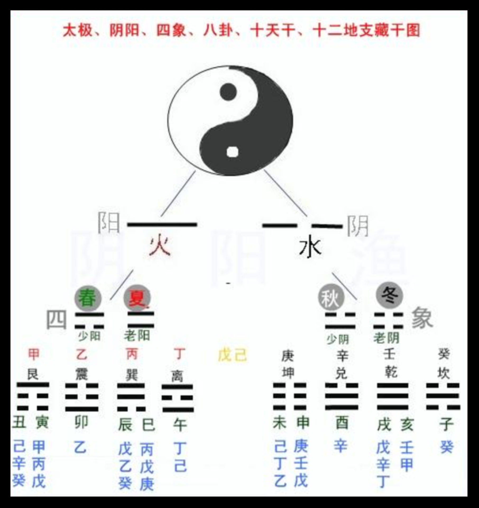
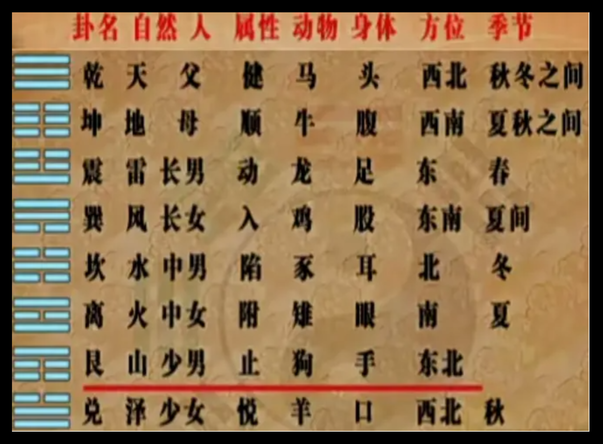

# 河图、洛书
### 1. 河图

### 2.洛书

> 戴九履一，  
> 左三右七，  
> 二四为肩，  
> 六八为足，  
> 五居中央。

# 八卦
### 1. 由来

> 是故，易有太极，太极生两仪，两仪生四象，四象生八卦，八卦定吉凶

### 2. 卦象

> 乾三连，坤六断。  
> 震仰盂，艮覆碗。  
> 离中虚，坎中满。  
> 兑上缺，巽下断。

### 3. 乾坤生六子

### 4. 八卦五行

> 乾(金)、兑(金)、离(火)、震(木)、巽(木)、坎(水)、艮(土)、坤(土)
> 

### 5. 后天八卦(挂位与术数)

> 一为坎来二为坤，  
> 三震四巽数中分，  
> 五居中央六乾足，  
> 七兑八艮九离门。  

### 6. 八卦结构系统

!

