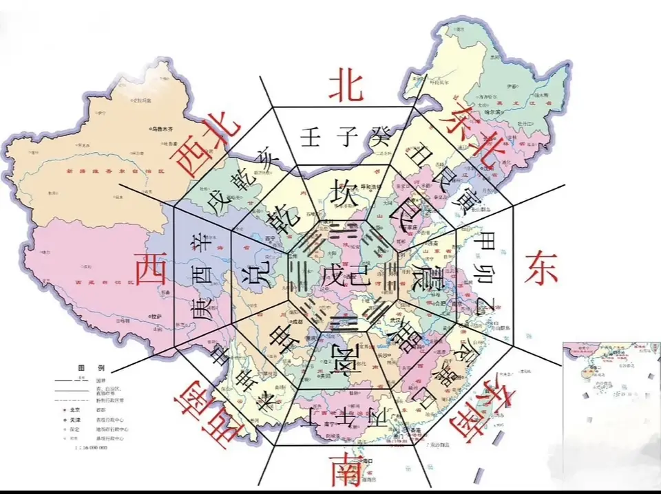

`北（水）`：内蒙  
`东北（土）`：山西，北京，天津，河北，黑龙江，吉林，辽宁  
`东（木）`：山东，江苏，安徽，浙江，上海  
`东南（火）`：福建，台湾，江西  
`南（火）`：广东，湖南，海南  
`西南（土）`：云南，贵州，四川，西藏  
`西（金）`：四川，重庆，青海  
`西北（金）`：甘肃，新疆，宁夏  
`中心`：陕西  

**主要城市五行属性**
## 京津

北京，五行属水;  
天津，五行属性为水火;  
`(天津五行气不专，所以不管人为如何推动其发展，也不可能成为标兵城市。)`

## 河北

石家庄  
石家庄，五行属金;  
秦皇岛，五行属土;  
承德，五行属水;  
唐山，五行属金;  
北戴河，五行属水;  
沧州，五行属水;  
廊坊，五行属土;  
衡水，五行属水;  
邢台，五行属土;  

## 山西

太原五行属土;  
大同五行属火;  
阳泉五行属水;  
晋中五行属土;  
运城五行属土;  
临汾五行属水;  
侯马五行属火;  
宁武五行属火;  
长治五行属水;  
离石五行属金;  

## 内蒙

呼和浩特五行属木;  
包头属火;  
鄂尔多斯五行属金;  
通辽五行属水;  
集宁五行属火;  
临河五行属水;  
乌海五行属水;  
赤峰五行属金;  

## 辽宁

大连五行属火;  
沈阳五行水火;  
鞍山五行属金;  
抚顺五行属木;  
盘锦五行属金;  
葫芦岛五行属土;  
海城五行属水;  
铁岭五行属金;  
丹东五行属木;  
本溪五行属水;  
营口五行属土;  
朝阳五行属火;  
阜新五行属金;  

## 吉林

长春五行属木;  
吉林五行属木;  
四平五行属水;  
通化五行属水;  
白山五行属金;  
松原五行属木;  
白城五行属金;  

## 黑龙江

哈尔滨五行属水;  
大庆五行属火;  
牡丹江五行属水;  
佳木斯五行属木;  
黑河五行属水;  

## 江苏

南京五行属火;  
无锡五行属金;  
扬州五行属木;  
苏州五行属木;  
常州、连云港五行属水;  
南通五行属火;  
泰州五行属水;  
镇江五行属水;  
江阴、张家港五行属水;  
启东五行属木;  

## 浙江

杭州五行属木;  
宁波五行属水;  
温州五行属水;  
义乌五行属火;  
台州五行属土;  
海宁五行为水火兼有;  
萧山五行属金;  
安吉五行属土;  
东阳五行属火;  

## 安徽

合肥五行属水;  
黄山五行属金;  
芜湖五行属水;  
蚌埠五行属土;  
阜阳五行属火;  
安庆五行属火;  
巢湖五行属水;  

## 福建

福州五行属土;  
厦门五行属火;  
泉州五行属水;  
龙岩五行属金;  
三明五行属火;  
石狮不论五行，直接取像;  

## 江西

南吕五行属土;  
九江五行属水;  
庐山五行属金;  
景德镇五行属金;  

## 山东

济南五行水带火;  
青岛五行属木;  
烟台五行火土;  
威海五行属水;  
日照五行属火;  

## 河南

郑州五行属土;  
洛阳五行属火;  
开封五行属土;  
南阳五行属火;  
平顶山五行属金；  

**以上内容整理于网络，仅供参考**
